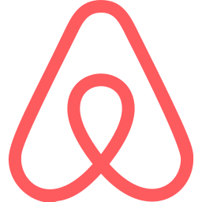

<p align="center">
  
</p>
<h1 align="center">Angular Airbnb Clone</h1>

> Maybe I won't finish this project. But, it is a study project, where I will test the changes brought by Angular 17. I could use nx, creating a more solid structure, but I chose not to use it.

<br />

## Table of contents
- [Tasks](#tasks)
- [How to use](#how-to-use)

## How to use
```sh
# in root folder, run
yarn start
```

## Tasks
- [ ] Create datepicker component
  - [x] Create toggle compoment
  - [ ] Create calendar component
    - [ ] The user can to select the start and finish date
    - [ ] The user can to navigate between months
      - [ ] Create carousel component
- [ ] Create top bar
  - [ ] Create user profile component
  - [ ] Create search component
  - [ ] Add animation when scolling
- [ ] Create advertising component
  - [ ] Create carousel component
  - [ ] Create advertising title component
  - [ ] Create advertising detail component
